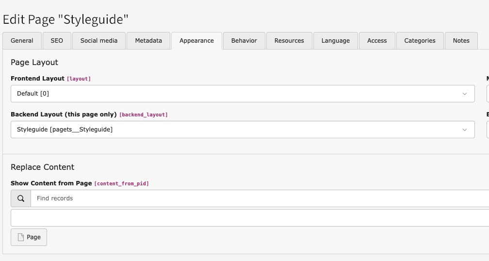
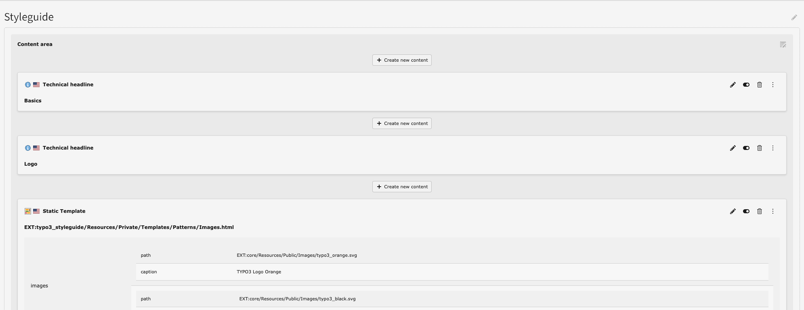

# Backend Layout

This extension provides a custom backend layout to offer the possibility to render a dedicated layout or to define content element restrictions for style guide pages.

The backend layout comes with the internal identifier: `pagets__Styleguide`.

