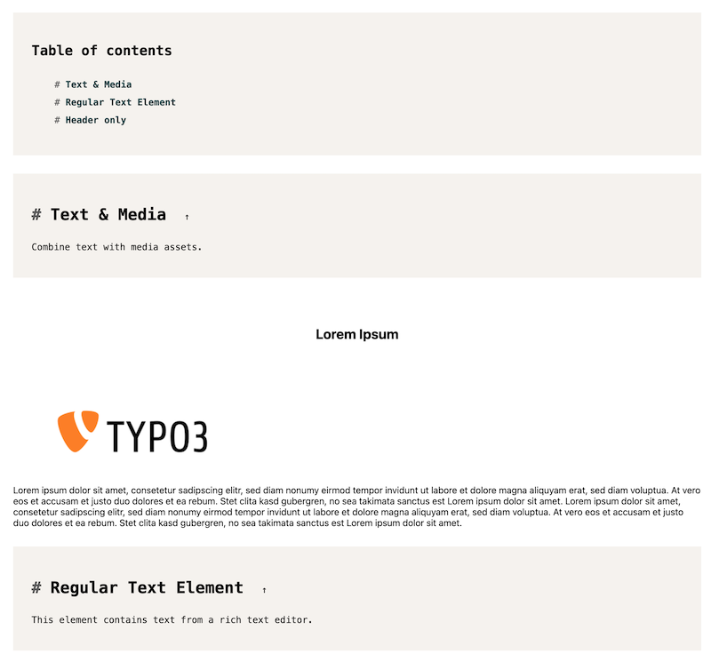
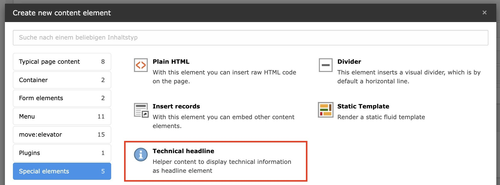

# `Technical Headline` Content Element

The `Technical Headline` content element can be used to create a structural headline for your styleguide or technical documentation.

> [!TIP]
> It automatically generates a table of contents for all technical headlines within the page, which can be used to navigate through the document.

Use the `Headline-Level` attribute to change the hierarchy of the headline. The default is `h2`, but you can also use `h1`, `h3`, `h4`.