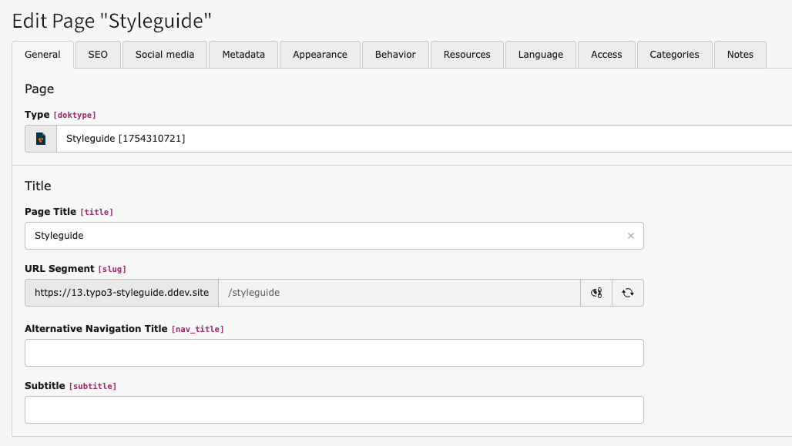

# Page Type

This extension registers a custom page type also known as doktype to offer the possibility to render a dedicated layout or the addition of custom page properties, etc. for style guide pages.

The registered page type has the ID: `1754310721`.

Furthermore, this extension hides some page properties for this page type by default (for more details, see `Configuration/TsConfig/TCEFORM.tsconfig`), provides a custom icon for these pages and enforces `noindex,nofollow` robots meta-tag rendering.

