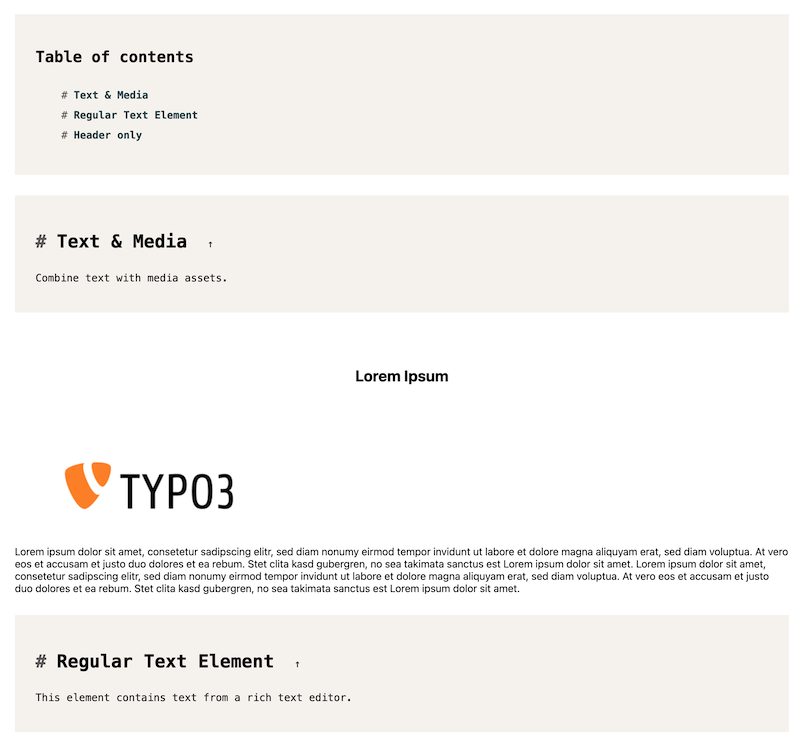
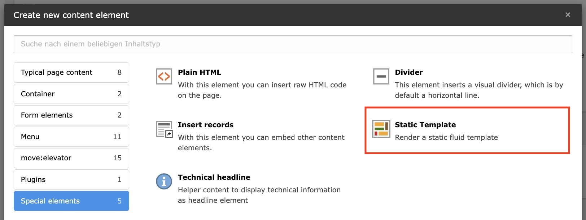

<div align="center">


# TYPO3 extension `typo3_styleguide`

[]()

</div>

This extension provides several tools for a TYPO3 styleguide.

## Installation

Install via composer:

``` bash
composer require move-elevator/typo3-styleguide
```

Include static TypoScript template or manually import it:

```
@import 'EXT:typo3_styleguide/Configuration/TypoScript/setup.typoscript'
```

## Documentation

### `Technical Headline` Content Element

The `Technical Headline` content element can be used to create a structural headline for your styleguide or technical documentation.



> It automatically generates a table of contents for all technical headlines within the page, which can be used to navigate through the document.


Use the `Headline-Level` attribute to change the hierarchy of the headline. The default is `h2`, but you can also use `h1`, `h3`, `h4`.

### Static Templates

This extension uses the flexible [EXT:bw_static_template](https://github.com/maikschneider/bw_static_template) to offer the possibility to render any templates for the style guide.



In addition to the content elements, it is therefore possible to render any template or partial from the project for dedicated display.

Therefor you have to provide the path to the template in the `Frontend template` field.

If the template expects additional parameters, these can be specified using JSON notation in the “JSON” field.


See the [Static templates documentation](https://github.com/maikschneider/bw_static_template/blob/main/README.md) for a more detailed documentation.

### Pattern

The predefined patterns are useful templates within a standard styleguide. These are mainly simple fluid templates which can be configured using the `Static templates` content element.

The following patterns are available:

#### Images

This pattern provides a simple image template that can be used to display images, e.g. logos consistently.


*Frontend template*: `EXT:typo3_styleguide/Resources/Private/Templates/Patterns/Images.html`

Example data:
```json
{
  "images": [
    {
      "path": "EXT:example/Resources/Public/Images/logo.svg",
      "caption": "home"
    }
  ]
}
```

#### Icons

This pattern provides a simple icon template that can be used to display all icons/images within a provided path.


*Frontend template*: `EXT:typo3_styleguide/Resources/Private/Templates/Patterns/Icons.html`

Example data:
```json
{
    "path": "EXT:example/Resources/Public/Icons/"
}
```

#### Colors

This pattern provides a simple color template that can be used to display colors consistently, e.g. for a color palette.


*Frontend template*: `EXT:typo3_styleguide/Resources/Private/Templates/Patterns/Colors.html`

Example data:
```json
{
    "colors": [
        {
            "color": "#EAE7E2",
            "label": "cararra"
        },
        {
            "color": "#002337",
            "label": "daintree"
        }
    ]
}
```

#### Font

This pattern provides a simple font template that can be used to display available fonts consistently, e.g. for a typography styleguide.


*Frontend template*: `EXT:typo3_styleguide/Resources/Private/Templates/Patterns/Fonts.html`

Example data:
```json
{
    "fonts": [
        {
            "font": "Lexend"
        },
        {
            "font": "Lexend",
            "fontWeight": 700,
            "label": "Lexend 700"
        }
    ]
}
```

### ViewHelpers

This extension provides a collection of TYPO3 ViewHelpers that can be reused in your templates.

See the [ViewHelpers documentation](./Documentation/ViewHelpers/CLASSES.md) for a complete list of available ViewHelpers.

## License

This project is licensed
under [GNU General Public License 2.0 (or later)](LICENSE.md).
